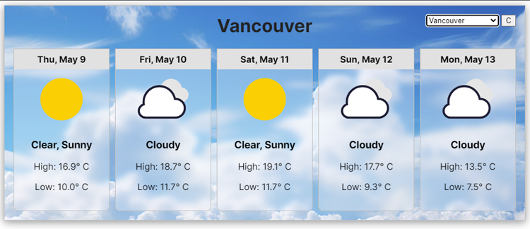

# Simple Demo React Weather Component

This project is a simple 5-day weather functional React component that fetches weather from my custom designed, pluggable PHP API hosted on my website. It shows the corresponding weather icon and high/low temps for hand picked Canadian cities and allows the user to choose between them. I wrote this component as a proof of concept to demonstrate my backend API's viability to support frontend projects with performance, accuracy and reliability.

## About the frontend:

- Customizable time display animation
- Temperature unit conversion between Celcius and Fahrenheit 
- Reponsive web design utilizing flexbox
- Modular CSS styling and animation using BEM notation
- Showcases state management, prop usage, async/await fetch API and event handling
- JSON usage for weather icons and their related conditions
- Supports several Canadian cities (Vancouver, Victoria, New Westminster, Toronto and Halifax)

## About the Backend:

The backend is a my own custom designed PHP 8+ API that supports many of my frontend projects (sorry the API is not open sourced). This project uses it for a proxy to [Tomorrow.io's](https://www.tomorrow.io/) free tier weather data. The API also features:

- Custom API key management
- Rate limiting per key
- Pluggable addon support (this project uses a custom weather service component I wrote)

**Note:** Due to the limitations of Tomorrow.io's free tier API, the API key in this demo may not work if overly used by multiple people. 

## Additional feature considerations:

This project is a demo and as such designed to be rather simple. However, if I was to add more functionality things I would consider would be...

- Supporting more cities that could be passed through props to the component and validated
- Add Kelvin units if anyone was ever interested in that unit type
- Add the ability to show 7-day in addition to the 5-day view
- Night time mode or dark mode
- Custom background to reflect the current day weather (lightning if the weather forecast for the day was thunder showers)

If you have any questions about this component, please feel free to reach out to me.
